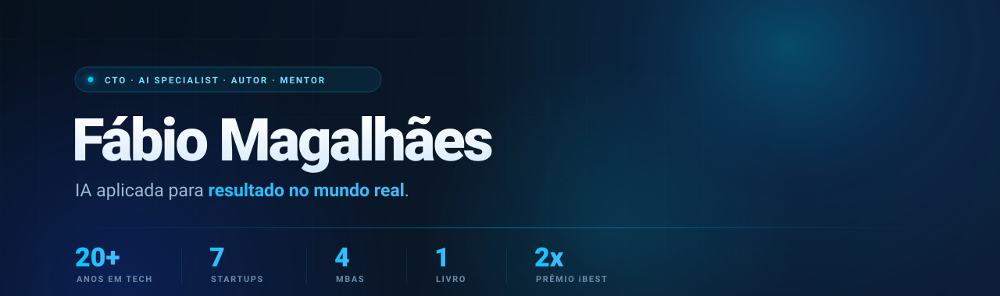

  

    

  
  
  
  

 

<h2>Sobre</h2>

<b>IA aplicada para negócios que querem resultado no mundo real.</b>

Engenheiro de Software, executivo de tecnologia e empreendedor com mais de <b>20 anos</b> transformando desafios de negócio em produtos, plataformas e soluções escaláveis. Entro no negócio, avalio processos, encontro gargalos e implemento IA onde ela paga a conta, com método, execução e profundidade técnica, através do diagnóstico proprietário <b>L.I.N.K. AI™</b>.

<blockquote><i>Acredito que tecnologia só faz sentido quando gera impacto real.</i></blockquote>

   
  
  
  
  
  

 

<h2>Áreas de Atuação</h2>

<table>
<tr>
<td valign="top" width="50%">

- Inteligência Artificial Generativa
- Agentes Inteligentes e Sistemas Agentic
- Arquitetura de Software
- Engenharia de Produtos Digitais
- Cloud Computing
- Serverless Architecture

</td>
<td valign="top" width="50%">

- Automação de Processos
- Liderança Técnica
- Estratégia de Tecnologia
- APIs e Integrações
- SaaS AI-First
- Transformação Digital

</td>
</tr>
</table>

 

<h2>Stack &amp; Tecnologias</h2>

<table>
<tr>
<td valign="top"><b>Backend</b></td>
<td></td>
</tr>
<tr>
<td valign="top"><b>Frontend</b></td>
<td></td>
</tr>
<tr>
<td valign="top"><b>Cloud &amp; Infra</b></td>
<td></td>
</tr>
<tr>
<td valign="top"><b>Dados</b></td>
<td>

</td>
</tr>
<tr>
<td valign="top"><b>IA &amp; Automação</b></td>
<td>

</td>
</tr>
</table>

 

<h2>Projetos em Construção</h2>

<table>
<tr>
<td valign="top" width="33%">

<h3>EPKA.AI</h3>
Plataforma <b>AI-First</b> voltada para marketing, automação, CRM e crescimento empresarial.

</td>
<td valign="top" width="33%">

<h3>AgenticEngine</h3>
Framework para criar e orquestrar <b>agentes inteligentes</b> que ampliam a capacidade operacional de pessoas e organizações.

</td>
<td valign="top" width="33%">

<h3>leiaAI</h3>
Plataforma educacional baseada em IA com <b>experiências personalizadas de aprendizado</b> para crianças e adolescentes.

</td>
</tr>
<tr>
<td valign="top" width="33%">

<h3>Ramppa</h3>
Marketplace inteligente para <b>operações logísticas</b>, conectando empresas e profissionais via tecnologia e automação.

</td>
<td valign="top" width="33%">

<h3>Amplia360</h3>
Laboratório de inovação e consultoria em <b>IA, automação e transformação digital</b>.

</td>
<td valign="top" width="33%"></td>
</tr>
</table>

 

<h2>Reconhecimentos</h2>

<ul>
<li><b>2x Vencedor do Prêmio iBest</b></li>
<li>Autor de <b><i>IAÊ, ROBÔ? Inteligência Artificial para Humanos de Verdade</i></b></li>
<li>Experiência internacional em projetos no Brasil e México</li>
<li>Fundador, CTO e líder técnico em múltiplas iniciativas de tecnologia e IA</li>
</ul>

 

<h2>Filosofia</h2>

<blockquote>
<h3><i>"A melhor tecnologia é aquela que desaparece para que o resultado apareça."</i></h3>
</blockquote>

Inteligência Artificial, automação e software devem <b>ampliar a capacidade humana, não substituí-la</b>. Meu objetivo é construir soluções que conectem <b>estratégia, produto, engenharia e negócios</b>, gerando resultados reais para empresas e pessoas.

 

<h2>Vamos nos conectar</h2>

  
  
  

    

  <i>Deus acima de tudo.</i>

